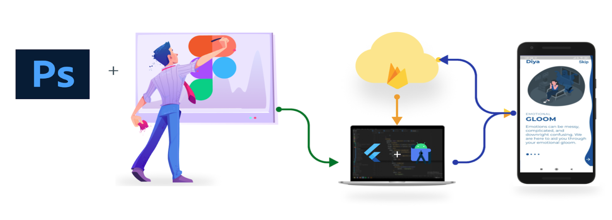

# diya_TechNox

## DIYA
Brightening the darkness away

# Problem Statement

Mental health issues are a stigma in our society. Whether young or old, many people undergo these issues, but nobody addresses them. Hence, we present to you, Diya with  an aim to destigmatize mental health issues. 

Through this app any user can help themselves by accessing  features such as guided meditation and yoga, connecting with psychologists and an interactive chatbot. Our app is intended for anyone with a mobile phone. Age isn't a restriction. From young to old, our app seeks to aid people with emotional help.

# Workflow


# Our Solution

Our user-friendly app provides a relaxing ambience and user privacy with a chatbot, which can be used to have a chill talk and in cases of people suffering from high stress/anxiety and other mental health issues, having an option of talking to a counsellor online through video call is implemented. The video calling idea is much easier to use and would be ideal for those who have trouble with in-person appointments.

Knowing the fact that music and meditation is used for relaxing our mind, research shows the benefits of music therapy for various mental health conditions, including depression, trauma, and schizophrenia (to name a few), which makes it a part of the solution.
When ze feels low, all they need is a little  motivation! And that’s also implemented in our app!

# Features

1. Chatbot: The chatbot can provide guidance or advice to help users challenge their negative thoughts. Modelling tactics from behavioural therapy, it encourages users to accept their emotions. 

2. Motivation Talk:  From a psychological aspect, motivation should generate within an individual and our app provides a platform the necessary help needed!
3. Talk to counsellor: Online video calling feature with the comfort of using from home, with a professional counsellor/psychiatrist.
4. Meditation/ Music: The meditation and Music feature is yet another interesting page where the user can casually calm down his/her mind by physical yoga asanas or by listening to soothing music!

# Tech Stack



```
Flutter
Dialogflow
Agora
Firebase
```
